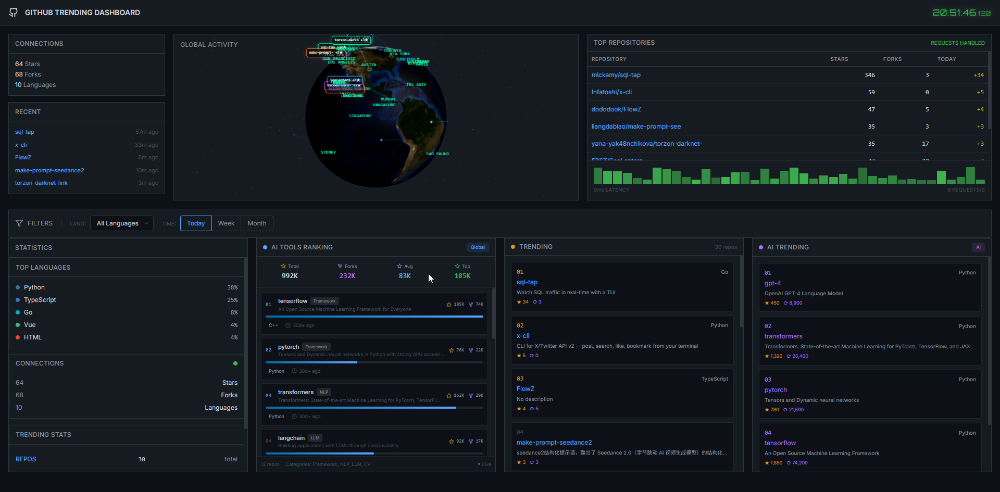

# GitHub Trending Dashboard

[中文文档](#中文文档) | [English Documentation](#english-documentation)

---



---

## English Documentation

A modern, real-time GitHub Trending Dashboard built with React and Three.js, featuring a 3D globe visualization and comprehensive repository analytics.

### Theme Colors

| Color | Hex | Usage |
|-------|-----|-------|
|  | `#0d1117` | Background |
|  | `#58a6ff` | Primary / Links |
|  | `#3fb950` | Success / Online |
|  | `#d29922` | Warning / Stars |
|  | `#a371f7` | AI / Special |

### Features

- **3D Globe Visualization** - Interactive global activity display using Three.js
- **Real-time Trending** - Fetch and display trending GitHub repositories (Top 10)
- **AI Trending** - Dedicated section for AI-related trending repositories
- **AI Tools Ranking** - Global ranking of AI development tools (Top 10)
- **Statistics Panel** - Comprehensive stats including stars, forks, and language distribution (Top 5 Languages)
- **Advanced Filtering** - Filter by programming language and time range (daily/weekly/monthly)
- **Responsive Design** - Fully responsive layout optimized for all screen sizes

### Data Display

| Panel | Items |
|-------|-------|
| Top Repositories | 10 repos |
| Trending List | 10 repos |
| AI Trending | 10 repos |
| AI Tools Ranking | 10 tools |
| Top Languages | 5 languages |
| Recent Activity | 5 repos |

### Tech Stack

| Technology | Purpose |
|------------|---------|
| React 18 | UI Framework |
| TypeScript | Type Safety |
| Three.js + React Three Fiber | 3D Globe Visualization |
| Framer Motion | Animations |
| Tailwind CSS | Styling |
| Vite | Build Tool |
| Axios | HTTP Client |
| Lucide React | Icons |

### Project Structure

```
github-trending-dashboard/
├── public/
│   └── image.png          # Dashboard preview
├── src/
│   ├── api/               # API service layer
│   ├── components/        # React components
│   │   ├── Globe.tsx      # 3D Globe component
│   │   ├── StatsPanel.tsx # Statistics panel
│   │   ├── TrendingList.tsx
│   │   ├── AITrendingList.tsx
│   │   ├── AIUsageRanking.tsx
│   │   ├── FilterPanel.tsx
│   │   └── Header.tsx
│   ├── types/             # TypeScript type definitions
│   ├── App.tsx            # Main application
│   └── main.tsx           # Entry point
├── package.json
└── vite.config.ts
```

### Getting Started

```bash
# Install dependencies
pnpm install

# Start development server
pnpm dev

# Build for production
pnpm build

# Preview production build
pnpm preview
```

### License

MIT

---

## 中文文档

基于 React 和 Three.js 构建的现代化 GitHub 趋势仪表板，具有 3D 地球可视化和全面的仓库分析功能。

### 主题配色

| 颜色 | Hex | 用途 |
|------|-----|------|
|  | `#0d1117` | 背景色 |
|  | `#58a6ff` | 主色调 / 链接 |
|  | `#3fb950` | 成功 / 在线 |
|  | `#d29922` | 警告 / 星标 |
|  | `#a371f7` | AI / 特殊 |

### 功能特性

- **3D 地球可视化** - 使用 Three.js 实现交互式全球活动展示
- **实时趋势** - 获取并展示 GitHub 趋势仓库（前十名）
- **AI 趋势** - AI 相关趋势仓库专属板块
- **AI 工具排名** - 全球 AI 开发工具排行榜（前十名）
- **统计面板** - 包含 Star、Fork 和语言分布的综合统计（前五种语言）
- **高级筛选** - 按编程语言和时间范围（每日/每周/每月）筛选
- **响应式设计** - 适配所有屏幕尺寸的完全响应式布局

### 数据展示

| 面板 | 数量 |
|------|------|
| 热门仓库 | 10 个 |
| 趋势列表 | 10 个 |
| AI 趋势 | 10 个 |
| AI 工具排名 | 10 个 |
| 热门语言 | 5 种 |
| 最近活动 | 5 个 |

### 技术栈

| 技术 | 用途 |
|------|------|
| React 18 | UI 框架 |
| TypeScript | 类型安全 |
| Three.js + React Three Fiber | 3D 地球可视化 |
| Framer Motion | 动画效果 |
| Tailwind CSS | 样式框架 |
| Vite | 构建工具 |
| Axios | HTTP 客户端 |
| Lucide React | 图标库 |

### 项目结构

```
github-trending-dashboard/
├── public/
│   └── image.png          # 仪表板预览图
├── src/
│   ├── api/               # API 服务层
│   ├── components/        # React 组件
│   │   ├── Globe.tsx      # 3D 地球组件
│   │   ├── StatsPanel.tsx # 统计面板
│   │   ├── TrendingList.tsx
│   │   ├── AITrendingList.tsx
│   │   ├── AIUsageRanking.tsx
│   │   ├── FilterPanel.tsx
│   │   └── Header.tsx
│   ├── types/             # TypeScript 类型定义
│   ├── App.tsx            # 主应用
│   └── main.tsx           # 入口文件
├── package.json
└── vite.config.ts
```

### 快速开始

```bash
# 安装依赖
pnpm install

# 启动开发服务器
pnpm dev

# 构建生产版本
pnpm build

# 预览生产构建
pnpm preview
```

### 许可证

MIT
